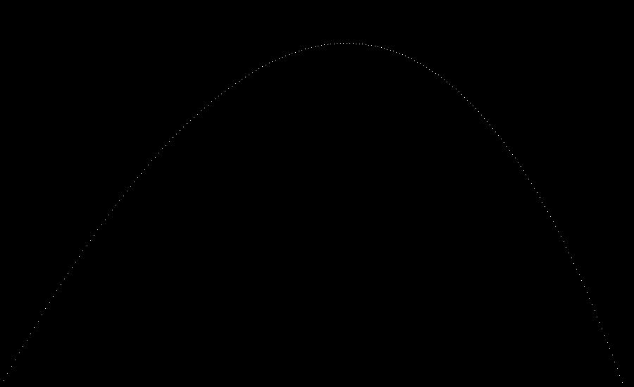
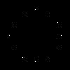

# Raytracer
[CLASS DOCUMENTATION](https://ilyas-erdogan.github.io/Raytracer/html/index.html)

# Example 1 - Simple Projectile Render
``` cpp
struct Projectile
{
	Point Position;
	Vector Velocity;
	Projectile(Point p, Vector v) : Position{ p }, Velocity{ v } {};
};

struct Environment
{
	Vector Gravity;
	Vector Wind;
	Environment(Vector g, Vector w) : Gravity{ g }, Wind{ w } {};
};

Projectile tick(Environment env, Projectile proj)
{
	Vector position = proj.Position + proj.Velocity;
	Vector velocity = proj.Velocity + env.Gravity + env.Wind;
	return Projectile(position, velocity);
}

int main()
{
	Point Start(0, 1, 0);
	Vector Velocity(1, 1.8, 0);
	Velocity.normalizeVector();
	Velocity *= 11.25;
	Projectile p(Start, Velocity);

	Vector Gravity(0, -0.1, 0);
	Vector Wind(-0.01, 0, 0);
	Environment e(Gravity, Wind);

	Canvas c(900, 550, Colour());

	while (p.Position.getY() >= 0)
	{
		p = tick(e, p);
		c.writePixel(static_cast<int>(p.Position.getX()), c.getCanvasHeight() - static_cast<int>(p.Position.getY()), Colour(1, 1, 1));
	}

	c.convertToPPM("projectile");

  return 0;
}
```
# Output


# Example 2 - Simple Clock Rotation Render

```cpp
int main()
{
	Canvas c(100, 100, Colour());
	const double pi = 3.1415926535897932385;
	Point origin(50, 0, 50);
	Point twelve(0, 0, 1);

	for (int i = 0; i < 12; i++)
	{
		Point toDraw = twelve * RotationY(i * pi / 6);
		toDraw *= 3.0/8;
		c.writePixel(origin.getX() + static_cast<int>(toDraw.getX() * c.getCanvasWidth()), origin.getZ() + static_cast<int>(toDraw.getZ() * c.getCanvasHeight()), Colour(1, 1, 1));
	}

	c.convertToPPM("clock");
	
	return 0;
}
```
# Output

