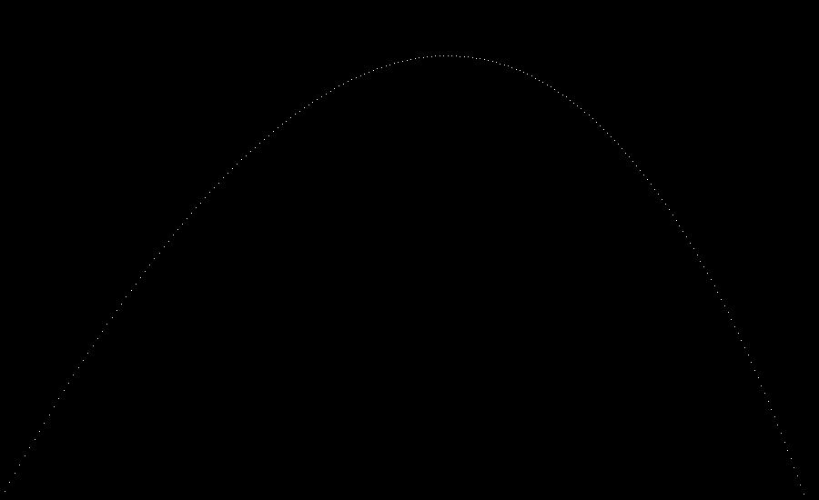
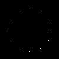
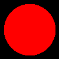
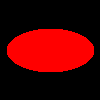
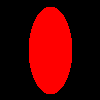
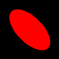

# Raytracer
[CLASS DOCUMENTATION](https://ilyas-erdogan.github.io/Raytracer/html/index.html)

# Example 1 - Simple Projectile Render
<details>
  <summary>Reveal Code Sample</summary>
  # Code
	```cpp
	struct Projectile
	{
		Point Position;
		Vector Velocity;
		Projectile(Point p, Vector v) : Position{ p }, Velocity{ v } {};
	};

	struct Environment
	{
		Vector Gravity;
		Vector Wind;
		Environment(Vector g, Vector w) : Gravity{ g }, Wind{ w } {};
	};

	Projectile tick(Environment env, Projectile proj)
	{
		Vector position = proj.Position + proj.Velocity;
		Vector velocity = proj.Velocity + env.Gravity + env.Wind;
		return Projectile(position, velocity);
	}

	int main()
	{
		Point Start(0, 1, 0);
		Vector Velocity(1, 1.8, 0);
		Velocity.normalizeVector();
		Velocity *= 11.25;
		Projectile p(Start, Velocity);

		Vector Gravity(0, -0.1, 0);
		Vector Wind(-0.01, 0, 0);
		Environment e(Gravity, Wind);

		Canvas c(900, 550, Colour());

		while (p.Position.getY() >= 0)
		{
			p = tick(e, p);
			c.writePixel(static_cast<int>(p.Position.getX()), c.getCanvasHeight() - static_cast<int>(p.Position.getY()), Colour(1, 1, 1));
		}

		c.convertToPPM("projectile");

	return 0;
	}
	```
</details>

# Output


# Example 2 - Simple Clock Rotation Render

```cpp
int main()
{
	Canvas c(100, 100, Colour());
	const double pi = 3.1415926535897932385;
	Point origin(50, 0, 50);
	Point twelve(0, 0, 1);

	for (int i = 0; i < 12; i++)
	{
		Point toDraw = twelve * RotationY(i * pi / 6);
		toDraw *= 3.0/8;
		c.writePixel(origin.getX() + static_cast<int>(toDraw.getX() * c.getCanvasWidth()), origin.getZ() + static_cast<int>(toDraw.getZ() * c.getCanvasHeight()), Colour(1, 1, 1));
	}

	c.convertToPPM("clock");
	
	return 0;
}
```
# Output


# Example 3 - Sphere Render With Optional Transformations
```cpp
int main()
{
	const double PI = 3.1415926535897932384626433832795028841971693993751058209;
	double wall_z = 10.0;
	Point ray_origin(0, 0, -5);
	double max_y = 1.0;
	double wall_size = 7.0;
	double canvas_pixels = 100.0;
	double pixel_size = wall_size / canvas_pixels;
	double half = wall_size / 2.0;
	double world_x, world_y;
	Colour black;
	Canvas c(100, 100, black);
	Colour red(1, 0, 0);
	std::shared_ptr<Sphere> shape = std::make_shared<Sphere>();

	//shape->setTransform(Scale(1, 0.5, 1)); // VARIATION ONE
	//shape->setTransform(Scale(0.5, 1, 1)); // VARIATION TWO
	//shape->setTransform(RotationZ(PI / 4) * Scale(0.5, 1, 1)); // VARIATION THREE
	//shape->setTransform(Shearing(1, 0, 0, 0, 0, 0) * Scale(0.5, 1, 1)); // VARIATION FOUR

	for (int y = 0; y < canvas_pixels; y++)
	{
		world_y = half - pixel_size * y;
		for (int x = 0; x < canvas_pixels; x++)
		{
			world_x = -half + pixel_size * x;

			Point position(world_x, world_y, wall_z);
			Ray r(ray_origin, (position - ray_origin).normalizeVector());
			std::vector<Intersection> xs = shape->intersect(r);
			if (shape->hit(xs) != nullptr)
			{
				c.writePixel(x, y, red);
			}
		}
	}
	c.convertToPPM("SphereVar4");
	std::cout << "DONE";
	return 0;
}
```

# Output
| Regular Sphere | Variation One | Variation Two | Variation Three | Variation Four |
| -------------- | ------------- | ------------- | --------------- | -------------- |
|  |  |  |  |  |