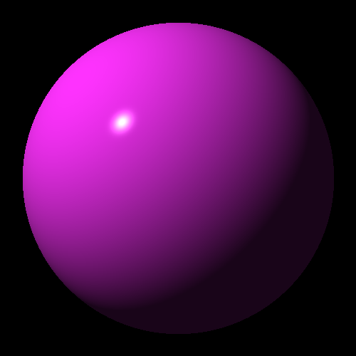
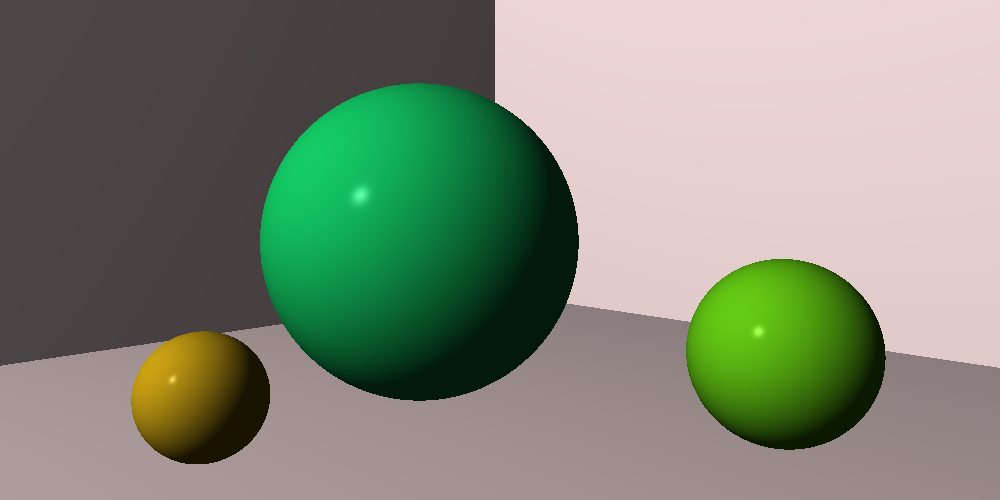

# Raytracer
[CLASS DOCUMENTATION](https://ilyas-erdogan.github.io/Raytracer/html/index.html)

# Example 1 - Simple Projectile Render
<details>
  <summary>Reveal Code Sample</summary>
# Code Sample
	
```cpp
	
struct Projectile
{
	Point Position;
	Vector Velocity;
	Projectile(Point p, Vector v) : Position{ p }, Velocity{ v } {};
};

struct Environment
{
	Vector Gravity;
	Vector Wind;
	Environment(Vector g, Vector w) : Gravity{ g }, Wind{ w } {};
};

Projectile tick(Environment env, Projectile proj)
{
	Vector position = proj.Position + proj.Velocity;
	Vector velocity = proj.Velocity + env.Gravity + env.Wind;
	return Projectile(position, velocity);
}

int main()
{
	Point Start(0, 1, 0);
	Vector Velocity(1, 1.8, 0);
	Velocity.normalizeVector();
	Velocity *= 11.25;
	Projectile p(Start, Velocity);

	Vector Gravity(0, -0.1, 0);
	Vector Wind(-0.01, 0, 0);
	Environment e(Gravity, Wind);

	Canvas c(900, 550, Colour());

	while (p.Position.getY() >= 0)
	{
		p = tick(e, p);
		c.writePixel(static_cast<int>(p.Position.getX()), c.getCanvasHeight() - static_cast<int>(p.Position.getY()), Colour(1, 1, 1));
	}

	c.convertToPPM("projectile");

	return 0;
}
```
</details>

# Output


# Example 2 - Simple Clock Rotation Render
<details> <summary>Reveal Code Sample</summary>
	
# Code Sample

```cpp
int main()
{
	Canvas c(100, 100, Colour());
	const double pi = 3.1415926535897932385;
	Point origin(50, 0, 50);
	Point twelve(0, 0, 1);

	for (int i = 0; i < 12; i++)
	{
		Point toDraw = twelve * RotationY(i * pi / 6);
		toDraw *= 3.0/8;
		c.writePixel(origin.getX() + static_cast<int>(toDraw.getX() * c.getCanvasWidth()), origin.getZ() + static_cast<int>(toDraw.getZ() * c.getCanvasHeight()), Colour(1, 1, 1));
	}

	c.convertToPPM("clock");
	
	return 0;
}
```

</details>

# Output


# Example 3 - Sphere Render With Optional Transformations

<details> <summary>Reveal Code Sample</summary>
	
# Code Sample

```cpp
int main()
{
	const double PI = 3.1415926535897932384626433832795028841971693993751058209;
	double wall_z = 10.0;
	Point ray_origin(0, 0, -5);
	double max_y = 1.0;
	double wall_size = 7.0;
	double canvas_pixels = 100.0;
	double pixel_size = wall_size / canvas_pixels;
	double half = wall_size / 2.0;
	double world_x, world_y;
	Colour black;
	Canvas c(100, 100, black);
	Colour red(1, 0, 0);
	std::shared_ptr<Sphere> shape = std::make_shared<Sphere>();

	//shape->setTransform(Scale(1, 0.5, 1)); // VARIATION ONE
	//shape->setTransform(Scale(0.5, 1, 1)); // VARIATION TWO
	//shape->setTransform(RotationZ(PI / 4) * Scale(0.5, 1, 1)); // VARIATION THREE
	//shape->setTransform(Shearing(1, 0, 0, 0, 0, 0) * Scale(0.5, 1, 1)); // VARIATION FOUR

	for (int y = 0; y < canvas_pixels; y++)
	{
		world_y = half - pixel_size * y;
		for (int x = 0; x < canvas_pixels; x++)
		{
			world_x = -half + pixel_size * x;

			Point position(world_x, world_y, wall_z);
			Ray r(ray_origin, (position - ray_origin).normalizeVector());
			std::vector<Intersection> xs = shape->intersect(r);
			if (shape->hit(xs) != nullptr)
			{
				c.writePixel(x, y, red);
			}
		}
	}
	c.convertToPPM("SphereVar4");
	std::cout << "DONE";
	return 0;
}
```

</details>

# Output
| Regular Sphere | Variation One | Variation Two | Variation Three | Variation Four |
| -------------- | ------------- | ------------- | --------------- | -------------- |
|  |  |  |  |  |

# Example 4 - Phong Reflection Model
<details> <summary>Reveal Code Sample</summary>
	
# Code Sample
```cpp
int main()
{
	const double PI = 3.1415926535897932384626433832795028841971693993751058209;

	Point ray_origin(0, 0, -5);
	double wall_z = 10;
	double wall_size = 7;

	double canvas_pixels = 100;
	double pixel_size = wall_size / canvas_pixels;
	double half = wall_size / 2.0;
	double world_x, world_y;
	
	Colour black;
	Canvas c(100, 100, black);
	Colour red(1, 0, 0);
	std::shared_ptr<Sphere> shape = std::make_shared<Sphere>();
	std::shared_ptr<Material> material = std::make_shared<Material>(Colour(1, 0.2, 1));
	shape->setMaterial(material);

	Point lightPosition(-10, 10, -10);
	Colour lightColour(1, 1, 1);
	PointLight light(lightPosition, lightColour);

	for (int y = 0; y < canvas_pixels; y++)
	{
		begin = std::chrono::high_resolution_clock::now();
		world_y = half - pixel_size * y;
		for (int x = 0; x < canvas_pixels; x++)
		{
			world_x = -half + pixel_size * x;
			Point position(world_x, world_y, wall_z);
			Ray r(ray_origin, (position - ray_origin).normalizeVector());
			std::vector<Intersection> xs = shape->intersect(r);
			if (shape->hit(xs) != nullptr)
			{
				Point point = r.getPosition(shape->hit(xs)->getT());
				Sphere s = *shape->hit(xs)->getObject();
				Vector normal = s.normalAt(point);
				Vector eye = -r.getDirection();
				c.writePixel(x, y, material->lighting(light, point, eye, normal));
			}
		}
	}

	c.convertToPPM("LitSphere");
	std::cout << "DONE";

	return 0;
}
```
</details>

# Output


# Example 4 - Virtual Camera
<details> <summary>Reveal Code Sample</summary>

# Code Sample
```cpp
int main()
{
	const double PI = 3.1415926535897932384626433832795028841971693993751058209;

	std::shared_ptr<Sphere> floor = std::make_shared<Sphere>();
	floor->setTransform(Scale(10, 0.01, 10));
	std::shared_ptr<Material> material = std::make_shared<Material>();
	material->setColour(Colour(1, 0.9, 0.9));
	material->setSpecular(0);
	floor->setMaterial(material);

	std::shared_ptr<Sphere> leftWall = std::make_shared<Sphere>();
	leftWall->setTransform(Translation(0, 0, 5) * RotationY(-PI / 4) * RotationX(PI / 2) * Scale(10, 0.01, 10));
	leftWall->setMaterial(material);

	std::shared_ptr<Sphere> rightWall = std::make_shared<Sphere>();
	rightWall->setTransform(Translation(0, 0, 5) * RotationY(PI / 4) * RotationX(PI / 2) * Scale(10, 0.1, 10));
	rightWall->setMaterial(material);

	std::shared_ptr<Sphere> middle = std::make_shared<Sphere>();
	middle->setTransform(Translation(-0.5, 1, 0.5));
	std::shared_ptr<Material> largeMaterial = std::make_shared<Material>();
	largeMaterial->setColour(Colour(0.1, 1, 0.5));
	largeMaterial->setDiffuse(0.7);
	largeMaterial->setSpecular(0.3);
	middle->setMaterial(largeMaterial);

	std::shared_ptr<Sphere> right = std::make_shared<Sphere>();
	right->setTransform(Translation(1.5, 0.5, -0.5) * Scale(0.5, 0.5, 0.5));
	std::shared_ptr<Material> rightMaterial = std::make_shared<Material>();
	rightMaterial->setColour(Colour(0.5, 1, 0.1));
	rightMaterial->setDiffuse(0.7);
	rightMaterial->setSpecular(0.3);
	right->setMaterial(rightMaterial);

	std::shared_ptr<Sphere> left = std::make_shared<Sphere>();
	left->setTransform(Translation(-1.5, 0.33, -0.75) * Scale(0.33, 0.33, 0.33));
	std::shared_ptr<Material> leftMaterial = std::make_shared<Material>();
	leftMaterial->setColour(Colour(1, 0.8, 0.1));
	leftMaterial->setDiffuse(0.7);
	leftMaterial->setSpecular(0.3);
	left->setMaterial(leftMaterial);

	World w(false);
	w.setLight(PointLight(Point(-10, 10, -10), Colour(1, 1, 1)));
	w.addObjects(floor);
	w.addObjects(leftWall);
	w.addObjects(rightWall);
	w.addObjects(middle);
	w.addObjects(right);
	w.addObjects(left);
	
	Camera camera(1000, 500, PI / 3);
	camera.setTransform(ViewTransform(Point(0, 1.5, -5), Point(0, 1, 0), Vector(0, 1, 0)));
	Canvas canvas = camera.render(w);

	canvas.convertToPPM("Scene");

	return 0;
}
```
</details>

# Output
Unoptomized Render Time: ~73 minutes.
Optomized Render Time: 55 seconds.
By caching inverse matrices, the raytracer can now render ~83% faster!
