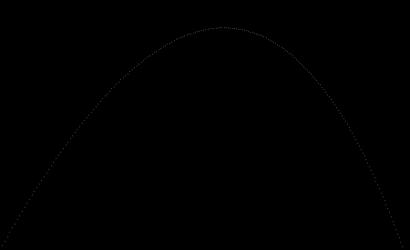

# Raytracer
[CLASS DOCUMENTATION](https://ilyas-erdogan.github.io/Raytracer/html/index.html)

# Example 1 - Simple Projectile Render
<details>
  <summary>Reveal Code Sample</summary>
# Code Sample
	
```cpp
	
struct Projectile
{
	Point Position;
	Vector Velocity;
	Projectile(Point p, Vector v) : Position{ p }, Velocity{ v } {};
};

struct Environment
{
	Vector Gravity;
	Vector Wind;
	Environment(Vector g, Vector w) : Gravity{ g }, Wind{ w } {};
};

Projectile tick(Environment env, Projectile proj)
{
	Vector position = proj.Position + proj.Velocity;
	Vector velocity = proj.Velocity + env.Gravity + env.Wind;
	return Projectile(position, velocity);
}

int main()
{
	Point Start(0, 1, 0);
	Vector Velocity(1, 1.8, 0);
	Velocity.normalizeVector();
	Velocity *= 11.25;
	Projectile p(Start, Velocity);

	Vector Gravity(0, -0.1, 0);
	Vector Wind(-0.01, 0, 0);
	Environment e(Gravity, Wind);

	Canvas c(900, 550, Colour());

	while (p.Position.getY() >= 0)
	{
		p = tick(e, p);
		c.writePixel(static_cast<int>(p.Position.getX()), c.getCanvasHeight() - static_cast<int>(p.Position.getY()), Colour(1, 1, 1));
	}

	c.convertToPPM("projectile");

	return 0;
}
```
</details>

# Output


# Example 2 - Simple Clock Rotation Render
<details> <summary>Reveal Code Sample</summary>
	
# Code Sample

```cpp
int main()
{
	Canvas c(100, 100, Colour());
	const double pi = 3.1415926535897932385;
	Point origin(50, 0, 50);
	Point twelve(0, 0, 1);

	for (int i = 0; i < 12; i++)
	{
		Point toDraw = twelve * RotationY(i * pi / 6);
		toDraw *= 3.0/8;
		c.writePixel(origin.getX() + static_cast<int>(toDraw.getX() * c.getCanvasWidth()), origin.getZ() + static_cast<int>(toDraw.getZ() * c.getCanvasHeight()), Colour(1, 1, 1));
	}

	c.convertToPPM("clock");
	
	return 0;
}
```

</details>

# Output


# Example 3 - Sphere Render With Optional Transformations

<details> <summary>Reveal Code Sample</summary>
	
# Code Sample

```cpp
int main()
{
	const double PI = 3.1415926535897932384626433832795028841971693993751058209;
	double wall_z = 10.0;
	Point ray_origin(0, 0, -5);
	double max_y = 1.0;
	double wall_size = 7.0;
	double canvas_pixels = 100.0;
	double pixel_size = wall_size / canvas_pixels;
	double half = wall_size / 2.0;
	double world_x, world_y;
	Colour black;
	Canvas c(100, 100, black);
	Colour red(1, 0, 0);
	std::shared_ptr<Sphere> shape = std::make_shared<Sphere>();

	//shape->setTransform(Scale(1, 0.5, 1)); // VARIATION ONE
	//shape->setTransform(Scale(0.5, 1, 1)); // VARIATION TWO
	//shape->setTransform(RotationZ(PI / 4) * Scale(0.5, 1, 1)); // VARIATION THREE
	//shape->setTransform(Shearing(1, 0, 0, 0, 0, 0) * Scale(0.5, 1, 1)); // VARIATION FOUR

	for (int y = 0; y < canvas_pixels; y++)
	{
		world_y = half - pixel_size * y;
		for (int x = 0; x < canvas_pixels; x++)
		{
			world_x = -half + pixel_size * x;

			Point position(world_x, world_y, wall_z);
			Ray r(ray_origin, (position - ray_origin).normalizeVector());
			std::vector<Intersection> xs = shape->intersect(r);
			if (shape->hit(xs) != nullptr)
			{
				c.writePixel(x, y, red);
			}
		}
	}
	c.convertToPPM("SphereVar4");
	std::cout << "DONE";
	return 0;
}
```

</details>

# Output
| Regular Sphere | Variation One | Variation Two | Variation Three | Variation Four |
| -------------- | ------------- | ------------- | --------------- | -------------- |
|  |  |  |  |  |

# Example 4 - Phong Reflection Model
<details> <summary>Reveal Code Sample</summary>
	
# Code Sample
```cpp
int main()
{
	const double PI = 3.1415926535897932384626433832795028841971693993751058209;

	Point ray_origin(0, 0, -5);
	double wall_z = 10;
	double wall_size = 7;

	double canvas_pixels = 100;
	double pixel_size = wall_size / canvas_pixels;
	double half = wall_size / 2.0;
	double world_x, world_y;
	
	Colour black;
	Canvas c(100, 100, black);
	Colour red(1, 0, 0);
	std::shared_ptr<Sphere> shape = std::make_shared<Sphere>();
	std::shared_ptr<Material> material = std::make_shared<Material>(Colour(1, 0.2, 1));
	shape->setMaterial(material);

	Point lightPosition(-10, 10, -10);
	Colour lightColour(1, 1, 1);
	PointLight light(lightPosition, lightColour);

	for (int y = 0; y < canvas_pixels; y++)
	{
		begin = std::chrono::high_resolution_clock::now();
		world_y = half - pixel_size * y;
		for (int x = 0; x < canvas_pixels; x++)
		{
			world_x = -half + pixel_size * x;
			Point position(world_x, world_y, wall_z);
			Ray r(ray_origin, (position - ray_origin).normalizeVector());
			std::vector<Intersection> xs = shape->intersect(r);
			if (shape->hit(xs) != nullptr)
			{
				Point point = r.getPosition(shape->hit(xs)->getT());
				Sphere s = *shape->hit(xs)->getObject();
				Vector normal = s.normalAt(point);
				Vector eye = -r.getDirection();
				c.writePixel(x, y, material->lighting(light, point, eye, normal));
			}
		}
	}

	c.convertToPPM("LitSphere");
	std::cout << "DONE";

	return 0;
}
```
</details>

# Output


# Example 4 - Virtual Camera
<details> <summary>Reveal Code Sample</summary>

# Code Sample
```cpp
int main()
{
	const double PI = 3.1415926535897932384626433832795028841971693993751058209;

	std::shared_ptr<Sphere> floor = std::make_shared<Sphere>();
	floor->setTransform(Scale(10, 0.01, 10));
	std::shared_ptr<Material> material = std::make_shared<Material>();
	material->setColour(Colour(1, 0.9, 0.9));
	material->setSpecular(0);
	floor->setMaterial(material);

	std::shared_ptr<Sphere> leftWall = std::make_shared<Sphere>();
	leftWall->setTransform(Translation(0, 0, 5) * RotationY(-PI / 4) * RotationX(PI / 2) * Scale(10, 0.01, 10));
	leftWall->setMaterial(material);

	std::shared_ptr<Sphere> rightWall = std::make_shared<Sphere>();
	rightWall->setTransform(Translation(0, 0, 5) * RotationY(PI / 4) * RotationX(PI / 2) * Scale(10, 0.1, 10));
	rightWall->setMaterial(material);

	std::shared_ptr<Sphere> middle = std::make_shared<Sphere>();
	middle->setTransform(Translation(-0.5, 1, 0.5));
	std::shared_ptr<Material> largeMaterial = std::make_shared<Material>();
	largeMaterial->setColour(Colour(0.1, 1, 0.5));
	largeMaterial->setDiffuse(0.7);
	largeMaterial->setSpecular(0.3);
	middle->setMaterial(largeMaterial);

	std::shared_ptr<Sphere> right = std::make_shared<Sphere>();
	right->setTransform(Translation(1.5, 0.5, -0.5) * Scale(0.5, 0.5, 0.5));
	std::shared_ptr<Material> rightMaterial = std::make_shared<Material>();
	rightMaterial->setColour(Colour(0.5, 1, 0.1));
	rightMaterial->setDiffuse(0.7);
	rightMaterial->setSpecular(0.3);
	right->setMaterial(rightMaterial);

	std::shared_ptr<Sphere> left = std::make_shared<Sphere>();
	left->setTransform(Translation(-1.5, 0.33, -0.75) * Scale(0.33, 0.33, 0.33));
	std::shared_ptr<Material> leftMaterial = std::make_shared<Material>();
	leftMaterial->setColour(Colour(1, 0.8, 0.1));
	leftMaterial->setDiffuse(0.7);
	leftMaterial->setSpecular(0.3);
	left->setMaterial(leftMaterial);

	World w(false);
	w.setLight(PointLight(Point(-10, 10, -10), Colour(1, 1, 1)));
	w.addObjects(floor);
	w.addObjects(leftWall);
	w.addObjects(rightWall);
	w.addObjects(middle);
	w.addObjects(right);
	w.addObjects(left);
	
	Camera camera(1000, 500, PI / 3);
	camera.setTransform(ViewTransform(Point(0, 1.5, -5), Point(0, 1, 0), Vector(0, 1, 0)));
	Canvas canvas = camera.render(w);

	canvas.convertToPPM("Scene");

	return 0;
}
```
</details>

# Output
### Unoptomized Render Time: ~73 minutes.
### Optomized Render Time: 55 seconds.
By caching inverse matrices, the raytracer can now render __~83% faster__!


# Example 5 - Shadows
<details> <summary>Reveal Code Sample</summary>

# Code Sample
```cpp
int main()
{
	const double PI = 3.1415926535897932384626433832795028841971693993751058209;

	std::shared_ptr<Sphere> floor = std::make_shared<Sphere>();
	floor->setTransform(Scale(10, 0.01, 10));
	std::shared_ptr<Material> material = std::make_shared<Material>();
	material->setColour(Colour(1, 0.9, 0.9));
	material->setSpecular(0);
	floor->setMaterial(material);

	std::shared_ptr<Sphere> leftWall = std::make_shared<Sphere>();
	leftWall->setTransform(Translation(0, 0, 5) * RotationY(-PI / 4) * RotationX(PI / 2) * Scale(10, 0.01, 10));
	leftWall->setMaterial(material);

	std::shared_ptr<Sphere> rightWall = std::make_shared<Sphere>();
	rightWall->setTransform(Translation(0, 0, 5) * RotationY(PI / 4) * RotationX(PI / 2) * Scale(10, 0.1, 10));
	rightWall->setMaterial(material);

	std::shared_ptr<Sphere> middle = std::make_shared<Sphere>();
	middle->setTransform(Translation(-0.5, 1, 0.5));
	std::shared_ptr<Material> largeMaterial = std::make_shared<Material>();
	largeMaterial->setColour(Colour(0.1, 1, 0.5));
	largeMaterial->setDiffuse(0.7);
	largeMaterial->setSpecular(0.3);
	middle->setMaterial(largeMaterial);

	std::shared_ptr<Sphere> right = std::make_shared<Sphere>();
	right->setTransform(Translation(1.5, 0.5, -0.5) * Scale(0.5, 0.5, 0.5));
	std::shared_ptr<Material> rightMaterial = std::make_shared<Material>();
	rightMaterial->setColour(Colour(0.5, 1, 0.1));
	rightMaterial->setDiffuse(0.7);
	rightMaterial->setSpecular(0.3);
	right->setMaterial(rightMaterial);

	std::shared_ptr<Sphere> left = std::make_shared<Sphere>();
	left->setTransform(Translation(-1.5, 0.33, -0.75) * Scale(0.33, 0.33, 0.33));
	std::shared_ptr<Material> leftMaterial = std::make_shared<Material>();
	leftMaterial->setColour(Colour(1, 0.8, 0.1));
	leftMaterial->setDiffuse(0.7);
	leftMaterial->setSpecular(0.3);
	left->setMaterial(leftMaterial);

	World w(false);
	w.setLight(PointLight(Point(0.5, 10, -1), Colour(1, 1, 1)));
	w.addObjects(floor);
	w.addObjects(rightWall);
	w.addObjects(leftWall);
	w.addObjects(rightWall);
	w.addObjects(middle);
	w.addObjects(right);
	w.addObjects(left);
	
	Camera camera(2000, 1000, PI / 3);
	camera.setTransform(ViewTransform(Point(0, 1.5, -5), Point(0, 1, 0), Vector(0, 1, 0)));

	Canvas canvas = camera.render(w);

	canvas.convertToPPM("Shadow");
	return 0;
}
```
</details>

# Output
### Render Time: ~395 seconds


# Example 6 - Planes
<details> <summary>Reveal Code Sample</summary>

# Code Sample
```cpp
int main()
{
	const double PI = 3.1415926535897932384626433832795028841971693993751058209;

	std::shared_ptr<Plane> floor = std::make_shared<Plane>();
	std::shared_ptr<Plane> wall = std::make_shared<Plane>();
	wall->setTransform(Translation(0, 0, 5) * RotationX(PI / 2));

	std::shared_ptr<Sphere> middle = std::make_shared<Sphere>();
	middle->setTransform(Translation(-0.5, 1, 0.5));
	std::shared_ptr<Material> largeMaterial = std::make_shared<Material>();
	largeMaterial->setColour(Colour(0.1, 1, 0.5));
	largeMaterial->setDiffuse(0.7);
	largeMaterial->setSpecular(0.3);
	middle->setMaterial(largeMaterial);

	std::shared_ptr<Sphere> right = std::make_shared<Sphere>();
	right->setTransform(Translation(1.5, 0.5, -0.5) * Scale(0.5, 0.5, 0.5));
	std::shared_ptr<Material> rightMaterial = std::make_shared<Material>();
	rightMaterial->setColour(Colour(0.5, 1, 0.1));
	rightMaterial->setDiffuse(0.7);
	rightMaterial->setSpecular(0.3);
	right->setMaterial(rightMaterial);

	std::shared_ptr<Sphere> left = std::make_shared<Sphere>();
	left->setTransform(Translation(-1.5, 0.33, -0.75) * Scale(0.33, 0.33, 0.33));
	std::shared_ptr<Material> leftMaterial = std::make_shared<Material>();
	leftMaterial->setColour(Colour(1, 0.8, 0.1));
	leftMaterial->setDiffuse(0.7);
	leftMaterial->setSpecular(0.3);
	left->setMaterial(leftMaterial);

	World w(false);
	w.setLight(PointLight(Point(0.5, 10, -1), Colour(1, 1, 1)));
	w.addObjects(floor);
	w.addObjects(middle);
	w.addObjects(right);
	w.addObjects(left);
	
	Camera camera(2000, 1000, PI / 3);
	camera.setTransform(ViewTransform(Point(0, 1.5, -5), Point(0, 1, 0), Vector(0, 1, 0)));

	Canvas canvas = camera.render(w);

	canvas.convertToPPM("PlaneScene");
	return 0;
}
```

</details>

# Output
### Render time: ~97 sec


# Example 7 - Patterns
<details> <summary>Reveal Code Sample</summary>

# Code Sample
```cpp
int main()
{
	const double PI = 3.1415926535897932384626433832795028841971693993751058209;

	// Patterns
	const double MAX = 255.0;
	std::shared_ptr<Pattern> floorPattern = std::make_shared<CheckersPattern>(Colour(38.0/MAX, 38.0 / MAX, 38.0 / MAX), Colour(181.0/MAX, 181.0 / MAX, 181.0 / MAX));
	std::shared_ptr<Pattern> wallPattern = std::make_shared<StripedPattern>(Colour(38.0 / MAX, 38.0 / MAX, 38.0 / MAX), Colour(181.0 / MAX, 181.0 / MAX, 181.0 / MAX));
	wallPattern->setPatternTransform(Scale(0.9, 0.9, 0.9) * RotationY(PI/9));
	std::shared_ptr<Pattern> leftSpherePattern = std::make_shared<RingPattern>(Colour(111.0/MAX, 255.0/MAX, 111.0/MAX), Colour(0, 166.0 / MAX, 0));
	leftSpherePattern->setPatternTransform(Scale(0.2, 0.2, 0.2));
	std::shared_ptr<Pattern> rightSpherePattern = std::make_shared<GradientPattern>(Colour(1.0, 165/MAX, 0), Colour(1, 0, 0));
	rightSpherePattern->setPatternTransform(Translation(-1, 0, 0) * Scale(2, 1, 1));

	// Floor
	std::shared_ptr<Object> floor = std::make_shared<Plane>();
	std::shared_ptr<Material> floorMaterial = std::make_shared<Material>();
	floorMaterial->setPattern(floorPattern);
	floor->setMaterial(floorMaterial);

	// Wall
	std::shared_ptr<Object> wall = std::make_shared<Plane>();
	wall->setTransform(Translation(0, 0, 5) * RotationX(PI / 2) );
	std::shared_ptr<Material> wallMaterial = std::make_shared<Material>();
	wallMaterial->setPattern(wallPattern);
	wall->setMaterial(wallMaterial);

	// Big Sphere
	std::shared_ptr<Object> bigSphere = std::make_shared<Sphere>();
	bigSphere->setTransform(Translation(-1, 1, 1.5) * RotationY(PI / 8) * RotationX(-PI / 2.5));
	std::shared_ptr<Material> bigSphereMaterial = std::make_shared<Material>();
	bigSphereMaterial->setPattern(leftSpherePattern);
	bigSphere->setMaterial(bigSphereMaterial);

	// Small Sphere
	std::shared_ptr<Object> smallSphere = std::make_shared<Sphere>();
	smallSphere->setTransform(Translation(1, 0.5, 1) * Scale(0.5, 0.5, 0.5));
	std::shared_ptr<Material> smallSphereMaterial = std::make_shared<Material>();
	smallSphereMaterial->setPattern(rightSpherePattern);
	smallSphere->setMaterial(smallSphereMaterial);

	World w(false);
	w.setLight(PointLight(Point(-10, 10, -10), Colour(1, 1, 1)));
	w.addObjects(floor);
	w.addObjects(wall);
	w.addObjects(bigSphere);
	w.addObjects(smallSphere);
	
	Camera camera(2000, 1000, PI / 3);
	camera.setTransform(ViewTransform(Point(0, 1.5, -5), Point(0, 1.0, -0.5), Vector(0, 1, 0)));

	Canvas canvas = camera.render(w);

	canvas.convertToPPM("PatternsScene");
	return 0;
}
```

</details>

# Output
### Render time: ~300 sec


# Example 8 - Reflection & Reflection
<details> <summary>Reveal Code Sample</summary>

# Code Sample
```cpp
int main()
{
	const double PI = 3.1415926535897932384626433832795028841971693993751058209;

	// Fresnel Effect
	World w(false);

	Camera camera(600, 600, 0.45);
	camera.setTransform(ViewTransform(Point(0, 0, -5), Point(0, 0, 0), Vector(0, 1, 0)));

	PointLight light(Point(2, 10, -5), Colour(0.9, 0.9, 0.9));
	w.setLight(light);

	std::shared_ptr<Object> wall = std::make_shared<Plane>();
	wall->setTransform(Translation(0, 0, 10) * RotationX(1.5708));
	std::shared_ptr<Material> wallMaterial = std::make_shared<Material>();
	std::shared_ptr<Pattern> wallPattern = std::make_shared<CheckersPattern>(Colour(0.15, 0.15, 0.15), Colour(0.85, 0.85, 0.85));
	wallMaterial->setPattern(wallPattern);
	wallMaterial->setAmbient(0.8);
	wallMaterial->setDiffuse(0.2);
	wallMaterial->setSpecular(0);
	wall->setMaterial(wallMaterial);
	w.addObjects(wall);

	std::shared_ptr<Object> ball = std::make_shared<Sphere>();
	std::shared_ptr<Material> ballMaterial = std::make_shared<Material>(Colour(1, 1, 1), 0, 0, 0.9, 300, 0.9, 0.9, 1.5);
	//ballMaterial->setPattern(std::make_shared<Pattern>(Colour(0, 0, 0), Colour(1, 1, 1)));
	ball->setMaterial(ballMaterial);
	w.addObjects(ball);
	 
	std::shared_ptr<Object> hollow = std::make_shared<Sphere>();
	hollow->setTransform(Scale(0.5, 0.5, 0.5));
	std::shared_ptr<Material> hollowMaterial = std::make_shared<Material>(Colour(1, 1, 1), 0, 0, 0.9, 300, 0.9, 0.9, 1.000273);
	//hollowMaterial->setPattern(std::make_shared<Pattern>(Colour(0, 0, 0), Colour(1, 1, 1)));
	hollow->setMaterial(hollowMaterial);
	w.addObjects(hollow);

	Canvas canvas = camera.render(w);

	canvas.convertToPPM("FresnelTest");


	// Refraction/Reflection Scene
	World w(false);

	Camera camera(800, 400, 1.152);
	camera.setTransform(ViewTransform(Point(-2.6, 1.5, -3.9), Point(-0.6, 1, -0.8), Vector(0, 1, 0)));

	PointLight light(Point(-4.9, 4.9, -1), Colour(1, 1, 1));
	w.setLight(light);

	// WALL
	std::shared_ptr<Pattern> wallPattern = std::make_shared<StripedPattern>(Colour(0.45, 0.45, 0.45), Colour(0.55, 0.55, 0.55));
	wallPattern->setPatternTransform(RotationY(1.5708) * Scale(0.25, 0.25, 0.25));
	std::shared_ptr<Material> wallMaterial = std::make_shared<Material>();
	wallMaterial->setPattern(wallPattern);
	wallMaterial->setAmbient(0);
	wallMaterial->setDiffuse(0.4);
	wallMaterial->setSpecular(0);
	wallMaterial->setReflectivity(0.3);

	// FLOOR
	std::shared_ptr<Object> floor = std::make_shared<Plane>();
	floor->setTransform(RotationY(0.31415));
	std::shared_ptr<Material> floorMaterial = std::make_shared<Material>();
	std::shared_ptr<Pattern> floorPattern = std::make_shared<CheckersPattern>(Colour(0.35, 0.35, 0.35), Colour(0.65, 0.65, 0.65));
	floorMaterial->setPattern(floorPattern);
	floorMaterial->setSpecular(0);
	floorMaterial->setReflectivity(0.4);
	floor->setMaterial(floorMaterial);
	w.addObjects(floor);

	// CEILING
	std::shared_ptr<Object> ceiling = std::make_shared<Plane>();
	ceiling->setTransform(Translation(0, 5, 0));
	std::shared_ptr<Material> ceilingMaterial = std::make_shared<Material>();
	ceilingMaterial->setColour(Colour(0.8, 0.8, 0.8));
	ceilingMaterial->setAmbient(0.3);
	ceilingMaterial->setSpecular(0);
	ceiling->setMaterial(ceilingMaterial);
	w.addObjects(ceiling);

	// WEST WALL
	std::shared_ptr<Object> westWall = std::make_shared<Plane>();
	westWall->setTransform(Translation(-5, 0, 0) * RotationZ(1.5708) * RotationY(1.5708));
	westWall->setMaterial(wallMaterial);
	w.addObjects(westWall);

	// EAST WALL
	std::shared_ptr<Object> eastWall = std::make_shared<Plane>();
	eastWall->setTransform(Translation(5, 0, 0) * RotationZ(1.5708) * RotationY(1.5708));
	eastWall->setMaterial(wallMaterial);
	w.addObjects(eastWall);

	// NORTH WALL
	std::shared_ptr<Object> northWall = std::make_shared<Plane>();
	northWall->setTransform(Translation(0, 0, 5) * RotationX(1.5708));
	northWall->setMaterial(wallMaterial);
	w.addObjects(northWall);

	// SOUTH WALL
	std::shared_ptr<Object> southWall = std::make_shared<Plane>();
	southWall->setTransform(Translation(0, 0, -5) * RotationX(1.5708));
	southWall->setMaterial(wallMaterial);
	w.addObjects(southWall);

	// BGBalls
	std::shared_ptr<Object> BGBall1 = std::make_shared<Sphere>();
	BGBall1->setTransform(Translation(4.6, 0.4, 1) * Scale(0.4, 0.4, 0.4));
	std::shared_ptr<Material> BGMaterial1 = std::make_shared<Material>();
	BGMaterial1->setColour(Colour(0.8, 0.5, 0.3));
	BGMaterial1->setShininess(50);
	BGBall1->setMaterial(BGMaterial1);
	w.addObjects(BGBall1);

	std::shared_ptr<Object> BGBall2 = std::make_shared<Sphere>();
	BGBall2->setTransform(Translation(4.7, 0.3, 0.4) * Scale(0.3, 0.3, 0.3));
	std::shared_ptr<Material> BGMaterial2 = std::make_shared<Material>();
	BGMaterial2->setColour(Colour(0.9, 0.4, 0.5));
	BGMaterial2->setShininess(50);
	BGBall2->setMaterial(BGMaterial2);
	w.addObjects(BGBall2);

	std::shared_ptr<Object> BGBall3 = std::make_shared<Sphere>();
	BGBall3->setTransform(Translation(-1, 0.5, 4.5) * Scale(0.5, 0.5, 0.5));
	std::shared_ptr<Material> BGMaterial3 = std::make_shared<Material>();
	BGMaterial3->setColour(Colour(0.4, 0.9, 0.6));
	BGMaterial3->setShininess(50);
	BGBall3->setMaterial(BGMaterial3);
	w.addObjects(BGBall3);

	std::shared_ptr<Object> BGBall4 = std::make_shared<Sphere>();
	BGBall4->setTransform(Translation(-1.7, 0.3, 4.7) * Scale(0.3, 0.3, 0.3));
	std::shared_ptr<Material> BGMaterial4 = std::make_shared<Material>();
	BGMaterial4->setColour(Colour(0.4, 0.6, 0.9));
	BGMaterial4->setShininess(50);
	BGBall4->setMaterial(BGMaterial4);
	w.addObjects(BGBall4);

	// FGBalls
	std::shared_ptr<Object> FGBall1 = std::make_shared<Sphere>();
	FGBall1->setTransform(Translation(-0.6, 1, 0.6));
	std::shared_ptr<Material> FGMaterial1 = std::make_shared<Material>();
	FGMaterial1->setColour(Colour(1, 0.3, 0.2));
	FGMaterial1->setSpecular(0.4);
	FGMaterial1->setShininess(5);
	FGBall1->setMaterial(FGMaterial1);
	w.addObjects(FGBall1);

	std::shared_ptr<Object> FGBall2 = std::make_shared<Sphere>();
	FGBall2->setTransform(Translation(0.6, 0.7, -0.6) * Scale(0.7, 0.7 ,0.7));
	std::shared_ptr<Material> FGMaterial2 = std::make_shared<Material>(Colour(0, 0, 0.2), 0, 0.4, 0.9, 300, 0.9, 0.9, 1.52);
	FGBall2->setMaterial(FGMaterial2);
	w.addObjects(FGBall2);
	std::cout << FGBall2->getMaterial()->getRefractiveIndex() << std::endl;

	std::shared_ptr<Object> FGBall3 = std::make_shared<Sphere>();
	FGBall3->setTransform(Translation(-0.7, 0.5, -0.8) * Scale(0.5, 0.5, 0.5));
	std::shared_ptr<Material> FGMaterial3 = std::make_shared<Material>(Colour(0, 0.2, 0), 0, 0.4, 0.9, 300, 0.9, 0.9, 1.52);
	FGBall3->setMaterial(FGMaterial3);
	w.addObjects(FGBall3);
	std::cout << FGBall3->getMaterial()->getRefractiveIndex() << std::endl;

	Canvas canvas = camera.render(w);

	canvas.convertToPPM("Chapter11Scene");

	return 0;
}
```
</details>

# Output
| Reflection & Refraction | Fresnel Effect Demonstration |
| -------------- | ------------- |
|  |  |